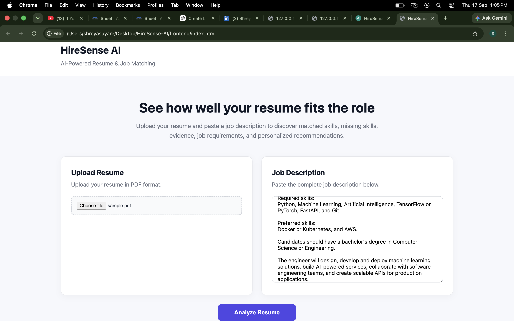
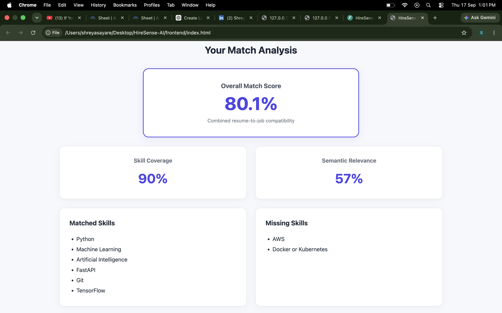
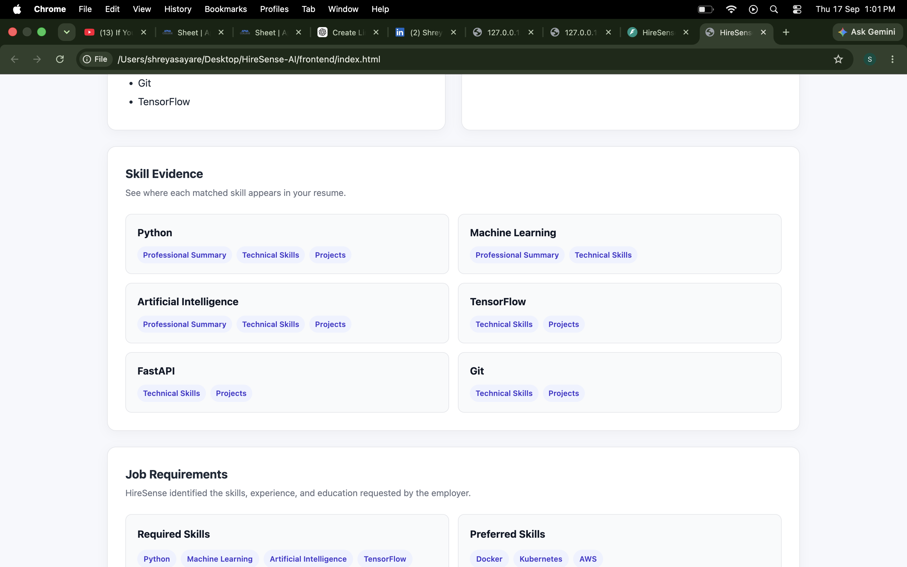
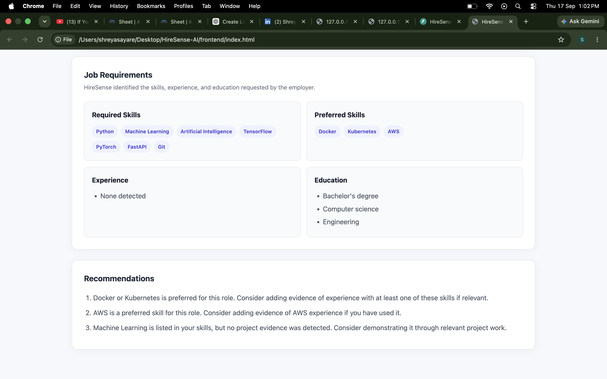

# HireSense AI

HireSense AI is an AI-powered resume and job description matching system that analyzes how well a candidate's resume aligns with a job opportunity.

It combines **skill-based matching**, **job requirement analysis**, **semantic similarity**, **resume evidence detection**, and **personalized recommendations** to provide a structured assessment of resume-job compatibility.

---

## Features

- Upload and analyze PDF resumes
- Extract and clean resume text automatically
- Detect technical skills from resumes and job descriptions
- Classify job skills as:
  - Required
  - Preferred
  - Unspecified
- Understand alternative skill requirements such as:
  - `TensorFlow or PyTorch`
  - `Docker or Kubernetes`
- Calculate weighted skill coverage
- Measure semantic similarity between a resume and job description
- Generate an overall resume-job match score
- Identify matched and missing skills
- Locate evidence for matched skills inside resume sections
- Extract experience and education requirements from job descriptions
- Generate priority-aware resume improvement recommendations
- Handle job descriptions with no recognized technical skills
- Provide a responsive web interface with validation and loading states
- Expose the analysis engine through a FastAPI REST API

---

## How HireSense AI Works

```text
PDF Resume
    |
    v
Resume Text Extraction
    |
    v
Text Cleaning & Section Detection
    |
    +----------------------+
    |                      |
    v                      v
Resume Skill          Skill Evidence
Extraction             Detection
    |
    v
Job Description
Requirement Analysis
    |
    +-----------------------------+
    |              |              |
    v              v              v
Required        Preferred     Alternative
Skills           Skills       Skill Groups
    |              |              |
    +--------------+--------------+
                   |
                   v
          Weighted Skill Score
                   |
                   +--------------------+
                   |                    |
                   v                    v
          Skill Coverage        Semantic Similarity
                                      using
                               all-MiniLM-L6-v2
                   |                    |
                   +---------+----------+
                             |
                             v
                    Overall Match Score
                             |
                             v
                 Personalized Recommendations
```

---

## Match Scoring

HireSense AI combines technical skill coverage with semantic similarity.

### Skill Weights

Job requirements are weighted according to their importance:

| Requirement Type | Weight |
| --- | ---: |
| Required Skill | 3 |
| Unspecified Skill | 2 |
| Preferred Skill | 1 |

Alternative requirements are treated as a single requirement.

For example:

```text
TensorFlow or PyTorch
```

is considered satisfied when the resume contains either TensorFlow or PyTorch.

### Overall Score

When recognized technical skills are available in the job description:

```text
Overall Match Score =
(0.70 × Skill Coverage) + (0.30 × Semantic Similarity)
```

This gives technical requirements greater importance while still considering the broader semantic relationship between the resume and job description.

If no supported technical skills are recognized in the job description, skill coverage is reported as `N/A` and the semantic similarity score is used as the overall score.

---

## Semantic Matching

HireSense AI uses the Sentence Transformers model:

```text
all-MiniLM-L6-v2
```

The resume and job description are converted into embeddings, and cosine similarity is used to measure their semantic relationship.

This allows the system to evaluate more than exact keyword overlap.

---

## Skill Evidence

HireSense AI does not only detect whether a skill exists in a resume. It also checks where that skill appears.

The current evidence engine analyzes important resume sections such as:

- Professional Summary
- Technical Skills
- Projects

This makes it possible to distinguish between a skill that is merely listed and one that is demonstrated through project experience.

---

## Recommendation Engine

Recommendations are generated using:

- Missing required skills
- Missing preferred skills
- Alternative skill requirements
- Skill evidence
- Job requirement priority

For example, if a candidate lists Machine Learning as a skill but does not demonstrate it in the Projects section, HireSense AI can recommend adding project evidence for that skill.

The recommendation engine also understands alternatives. If a job accepts:

```text
TensorFlow or PyTorch
```

and the resume already contains TensorFlow, the system does not incorrectly recommend learning PyTorch just to satisfy that requirement.

---

## Tech Stack

### Backend

- Python
- FastAPI
- PyMuPDF
- Sentence Transformers
- Uvicorn

### AI / NLP

- `all-MiniLM-L6-v2`
- Sentence embeddings
- Cosine similarity
- Rule-based skill extraction
- Requirement-aware skill matching

### Frontend

- HTML5
- CSS3
- JavaScript

### Development

- Git
- GitHub
- Python virtual environment

---

## Project Structure

```text
HireSense-AI/
│
├── app/
│   ├── __init__.py
│   ├── api.py
│   ├── matcher.py
│   ├── parser.py
│   ├── recommendations.py
│   ├── requirements.py
│   ├── semantic.py
│   └── skills.py
│
├── frontend/
│   ├── index.html
│   ├── script.js
│   └── style.css
│
├── sample_jobs/
│   └── job_description.txt
│
├── .gitignore
├── README.md
└── requirements.txt
```

Local resume files are intentionally excluded from version control through `.gitignore`.

---

## Installation

### 1. Clone the repository

```bash
git clone https://github.com/ayareshreyas/HireSense-AI.git
cd HireSense-AI
```

### 2. Create a virtual environment

#### macOS / Linux

```bash
python3 -m venv .venv
source .venv/bin/activate
```

#### Windows

```bash
python -m venv .venv
.venv\Scripts\activate
```

### 3. Install dependencies

```bash
pip install -r requirements.txt
```

The semantic model may be downloaded automatically the first time the application starts.

---

## Running the Backend

Start the FastAPI development server:

```bash
uvicorn app.api:app --reload
```

By default, the API will run locally on port `8000`.

FastAPI also provides interactive API documentation at:

```text
http://127.0.0.1:8000/docs
```

---

## Running the Frontend

Keep the FastAPI backend running.

Then open a second terminal from the project directory and run:

```bash
cd frontend
python3 -m http.server 5500
```

Open:

```text
http://127.0.0.1:5500
```

Upload a PDF resume, paste a job description, and select **Analyze Resume**.

---

## API Endpoints

### `GET /`

Checks whether the HireSense AI API is running.

Example response:

```json
{
  "message": "HireSense AI API is running."
}
```

### `GET /health`

Health-check endpoint.

Example response:

```json
{
  "status": "healthy"
}
```

### `POST /analyze`

Analyzes a resume against a job description.

The endpoint accepts multipart form data containing:

| Field | Type | Description |
| --- | --- | --- |
| `resume` | File | PDF resume |
| `job_description` | String | Job description text |

The analysis can include:

- Resume skills
- Job skills
- Matched skills
- Missing skills
- Skill evidence
- Skill coverage score
- Semantic similarity score
- Overall match score
- Required skills
- Preferred skills
- Unspecified skills
- Alternative skill groups
- Experience requirements
- Education requirements
- Personalized recommendations

Only PDF resumes are currently supported.

---

## Example Job Description

A sample job description is available in:

```text
sample_jobs/job_description.txt
```

Example:

```text
AI/ML Engineer

Required skills:
Python, Machine Learning, Artificial Intelligence, TensorFlow or PyTorch, FastAPI, and Git.

Preferred skills:
Docker or Kubernetes, and AWS.

Candidates should have a bachelor's degree in Computer Science or Engineering.

The engineer will design, develop and deploy machine learning solutions, build AI-powered services, collaborate with software engineering teams, and create scalable APIs for production applications.
```

---

## Screenshots

### Resume Analysis Interface

The main interface allows users to upload a PDF resume and paste a job description for analysis.



### Match Analysis

HireSense AI combines weighted skill coverage with semantic relevance to generate an overall resume-job match score.



### Skill Evidence

Matched skills are traced back to relevant resume sections such as the Professional Summary, Technical Skills, and Projects.



### Job Requirements & Recommendations

The system identifies job requirements and generates requirement-aware recommendations based on missing skills and resume evidence.



---

## Current Limitations

HireSense AI is currently designed as a portfolio-scale MVP.

Some current limitations include:

- Only text-based PDF resumes are supported
- Scanned/image-only PDFs may not contain extractable text
- Skill extraction currently uses a predefined skill dictionary
- Resume section detection depends on recognizable section headings
- Experience and education extraction is rule-based
- Semantic similarity is calculated across the overall resume and job description
- The system provides resume-job matching assistance rather than making hiring decisions

---

## Future Improvements

Potential future improvements include:

- DOCX resume support
- OCR support for scanned resumes
- Larger and dynamically configurable skill taxonomy
- LLM-assisted job requirement extraction
- More advanced resume section detection
- Section-level semantic matching
- Authentication and user accounts
- Analysis history
- Resume comparison across multiple job descriptions
- Resume improvement suggestions with rewritten examples
- Cloud deployment and persistent storage

---

## Privacy

Uploaded resumes are processed temporarily by the backend.

The API creates a temporary PDF file during analysis and removes it after the request finishes. Resume files are not intentionally stored permanently by the application.

The `sample_resumes/` directory is also excluded from Git version control to reduce the risk of accidentally committing personal resume files.

---

## Purpose

HireSense AI was built as a portfolio project to explore practical applications of:

- Natural Language Processing
- Sentence embeddings
- Semantic similarity
- Resume parsing
- Requirement extraction
- Weighted matching algorithms
- Recommendation systems
- REST API development
- Frontend-backend integration

---

## Author

**Shreyas Ayare**

Computer Science & Engineering — Artificial Intelligence & Machine Learning

GitHub: [ayareshreyas](https://github.com/ayareshreyas)

LinkedIn: [Shreyas Ayare](https://www.linkedin.com/in/shreyas-ayare)

---

## License

This project currently does not include an open-source license. All rights are reserved by the author.


